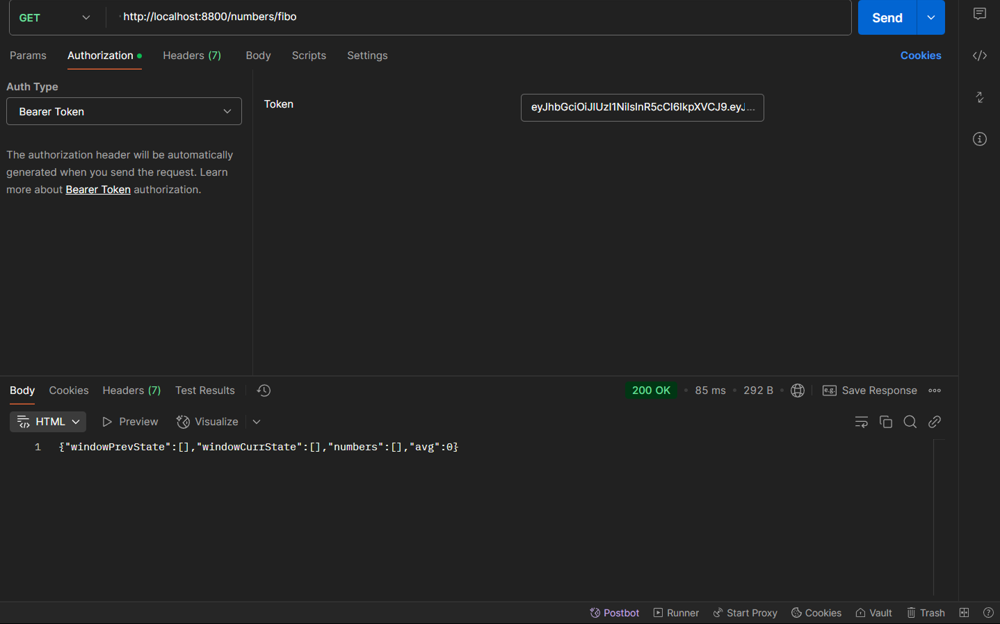
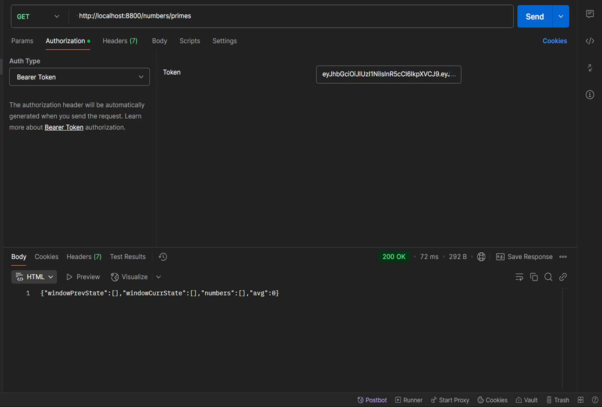
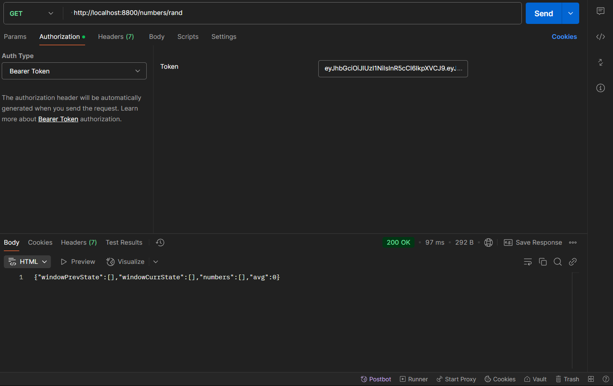

# Problem 1

## Prerequisites

1. Clone the repository to your local machine.
2. Ensure that **Node.js** is installed in your environment.

## Installation

Install the necessary dependencies by running the following command in your terminal:

```sh
npm install express axios
```

## Running the Server

Start the server by executing:

```sh
node server.js
```

## Output Screenshots

### Even Number API
 <!-- Fixed the file name and removed angle brackets -->

### Fibonacci Number API


### Prime Number API


### Random Number API



